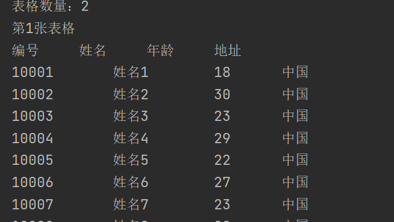

## POI导入word

使用之前生成的文件导入


读取文本：

```java
package mao;

import org.apache.poi.xwpf.usermodel.XWPFDocument;
import org.apache.poi.xwpf.usermodel.XWPFParagraph;
import org.apache.poi.xwpf.usermodel.XWPFRun;

import java.io.FileInputStream;
import java.util.List;

/**
 * Project name(项目名称)：java报表_POI导入word
 * Package(包名): mao
 * Class(类名): Test1
 * Author(作者）: mao
 * Author QQ：1296193245
 * GitHub：https://github.com/maomao124/
 * Date(创建日期)： 2023/6/6
 * Time(创建时间)： 21:43
 * Version(版本): 1.0
 * Description(描述)： 无
 */

public class Test1
{
    public static void main(String[] args)
    {
        try (FileInputStream fileInputStream = new FileInputStream("./out.docx"))
        {
            XWPFDocument xwpfDocument = new XWPFDocument(fileInputStream);

            //读取所有段落
            List<XWPFParagraph> paragraphs = xwpfDocument.getParagraphs();
            for (XWPFParagraph paragraph : paragraphs)
            {
                System.out.println("---------段落开始-----------");

                //得到所有端
                List<XWPFRun> runs = paragraph.getRuns();
                System.out.println("句子数量：" + runs.size());
                for (XWPFRun run : runs)
                {
                    System.out.print(run);
                }

                System.out.println();
                System.out.println("---------段落结束-----------");
            }
        }
        catch (Exception e)
        {
            e.printStackTrace();
        }

    }
}
```


结果：

```sh
---------段落开始-----------
句子数量：2
Microsoft Office Word是微软公司的一个文字处理器应用程序。它最初是由Richard Brodie为了运行DOS的IBM计算机而在1983年编写的。随后的版本可运行于Apple Macintosh (1984年)、SCO UNIX和Microsoft Windows (1989年)，并成为了Microsoft Office的一部分。Word给用户提供了用于创建专业而优雅的文档工具，帮助用户节省时间，并得到优雅美观的结果。
---------段落结束-----------
---------段落开始-----------
句子数量：2
一直以来，Microsoft Office Word 都是最流行的文字处理程序。作为 Office 套件的核心程序， Word 提供了许多易于使用的文档创建工具，同时也提供了丰富的功能集供创建复杂的文档使用。哪怕只使用 Word 应用一点文本格式化操作或图片处理，简单的文档变得比只使用纯文本更具吸引力。


---------段落结束-----------
```


读取表格：

```java
package mao;

import org.apache.poi.xwpf.usermodel.*;

import java.io.FileInputStream;
import java.util.List;

/**
 * Project name(项目名称)：java报表_POI导入word
 * Package(包名): mao
 * Class(类名): Test2
 * Author(作者）: mao
 * Author QQ：1296193245
 * GitHub：https://github.com/maomao124/
 * Date(创建日期)： 2023/6/6
 * Time(创建时间)： 22:00
 * Version(版本): 1.0
 * Description(描述)： 无
 */

public class Test2
{
    public static void main(String[] args)
    {
        try (FileInputStream fileInputStream = new FileInputStream("./out2.docx"))
        {
            XWPFDocument xwpfDocument = new XWPFDocument(fileInputStream);

            //得到所有表格
            List<XWPFTable> tables = xwpfDocument.getTables();
            System.out.println("表格数量：" + tables.size());

            int tableIndex = 1;
            //遍历表格
            for (XWPFTable table : tables)
            {
                System.out.println("第" + tableIndex + "张表格");
                tableIndex++;
                //得到行数据
                List<XWPFTableRow> rows = table.getRows();
                //遍历行
                for (XWPFTableRow row : rows)
                {
                    //得到单元格
                    List<XWPFTableCell> cells = row.getTableCells();
                    //遍历单元格
                    for (XWPFTableCell cell : cells)
                    {
                        System.out.print(cell.getText() + "\t\t");
                    }
                    System.out.println();
                }
                System.out.println("\n\n");
            }
        }
        catch (Exception e)
        {
            e.printStackTrace();
        }
    }
}
```


```sh
表格数量：2
第1张表格
编号		姓名		年龄		地址		
10001		姓名1		18		中国		
10002		姓名2		30		中国		
10003		姓名3		23		中国		
10004		姓名4		29		中国		
10005		姓名5		22		中国		
10006		姓名6		27		中国		
10007		姓名7		23		中国		
10008		姓名8		28		中国		
10009		姓名9		15		中国		
10010		姓名10		29		中国		


第2张表格
编号		姓名		年龄		地址		
10001		姓名1		20		中国		
10002		姓名2		20		中国		
10003		姓名3		15		中国		
10004		姓名4		22		中国		
10005		姓名5		26		中国		
10006		姓名6		27		中国		
10007		姓名7		24		中国		
10008		姓名8		28		中国		
10009		姓名9		27		中国		
10010		姓名10		28		中国		

```





